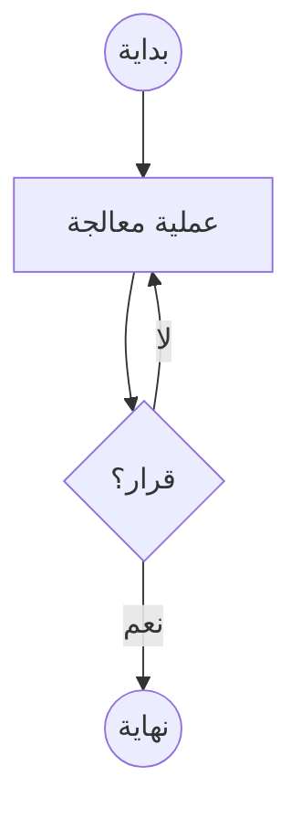
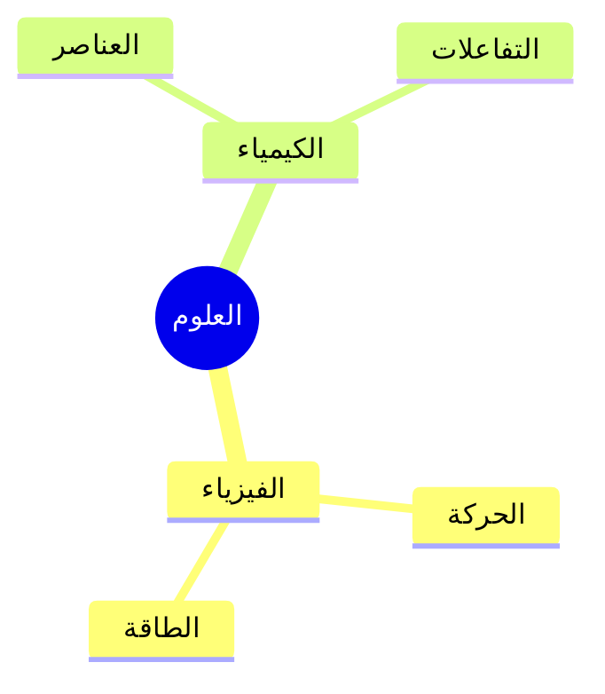

# دليل الاستخدام

مرحباً بك في المحرر المتقدم. يدعم هذا الموقع Markdown لتنسيق النصوص، MathJax للمعادلات الرياضية (مع دعم العربية)، و Mermaid للخرائط الذهنية.

## 1. تنسيق النصوص (Markdown)
يمكنك استخدام التنسيقات التالية:
- **خط عريض**: `**نص عريض**`
- *خط مائل*: `*نص مائل*`
- عناوين: `# عنوان رئيسي`، `## عنوان فرعي`
- قوائم:
  - `* عنصر قائمة`
  - `1. قائمة مرقمة`

## 2. الجداول
لإنشاء جدول، استخدم الخطوط العمودية `|` والشرطات `-`:

```markdown
| الاسم     | الدرجة   |
|-----------|-----------|
| محمد      | ٩٥        |
| خالد      | ٨٨        |
```

## 3. المعادلات الرياضية العربية
المحرر يستخدم إضافة `arabic-mathjax` لدعم الرياضيات العربية.

### الأمر الأساسي: `\ar{}`
استخدم `\ar{...}` حول معادلتك لعكسها وعرضها بالرموز العربية.

**مثال:**
`$$ \ar{ x = 5 } $$`
سيظهر كـ: س = ٥ (معكوسة).

**مثال القانون العام:**
`$$ \ar{ x = \frac{-b \pm \sqrt{b^2 - 4ac}}{2a} } $$`

### ترجمة الرموز
الإضافة تقوم تلقائياً بترجمة بعض الرموز عند استخدام `\ar`:
- `\sin` -> `جا`
- `\cos` -> `جتا`
- `\tan` -> `ظا`
- `\lim` -> `نها`
- `\sqrt` -> الجذر العربي (مقلوب)

### استخدام الرموز العربية يدوياً
يمكنك استخدام أوامر محددة لتعريب المتغيرات:
- `a` -> `ا`
- `b` -> `ب`
- `c` -> `جـ`
- `x` -> `س`
- `y` -> `ص`
- `z` -> `ع`

## 4. الخرائط الذهنية (Mermaid)
لإنشاء مخطط، استخدم كتلة كود `mermaid`.

### مخطط انسيابي (Flowchart)


### خريطة ذهنية (Mindmap)


## اختصارات لوحة المفاتيح
حالياً الموقع يدعم الكتابة المباشرة. استخدم زر "طريقة الاستخدام" دائماً للرجوع لهذا الدليل.
